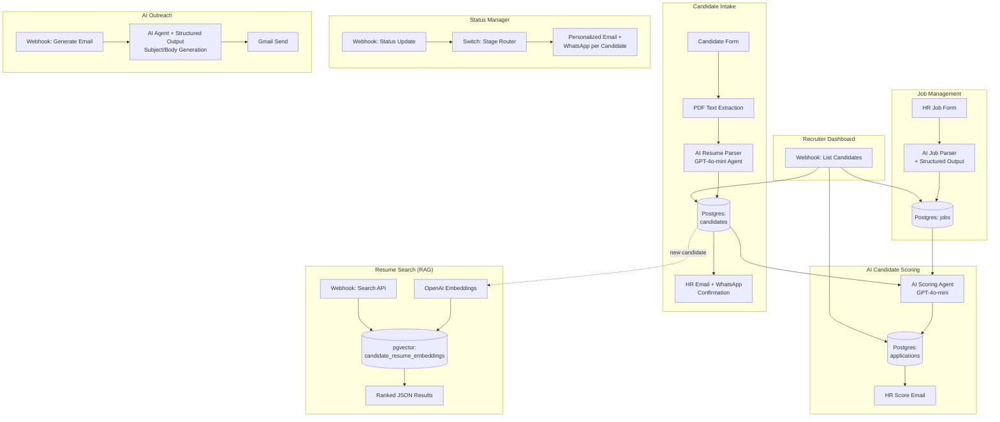

# AI Recruitment Assistant

**An end-to-end AI-powered recruitment automation platform** — resume parsing, semantic candidate search, AI-driven scoring, and personalized outreach, built entirely on n8n with LLM agents, structured output parsing, and pgvector RAG.

Built as a portfolio project demonstrating production-grade AI engineering and workflow automation, with an eye toward productizing as a B2B SaaS offering for recruitment teams.

---

## The Problem

Recruitment teams drown in repetitive, high-volume work: manually reading resumes, comparing candidates against job requirements, chasing status updates across email/WhatsApp, and searching past applicants when a new role opens. This system automates that pipeline end-to-end while keeping a human recruiter in control of every decision.

## Architecture



**Full workflow canvas:**


## Key Features

| Feature | What it does | AI/Engineering pattern demonstrated |
|---|---|---|
| **Resume Parsing** | Extracts structured candidate data (skills, experience, education, CTC) from raw PDF resumes | LLM agent with strict JSON schema enforcement, PDF text extraction pipeline |
| **AI Candidate Scoring** | Scores candidates 0–100 against job requirements with matched/missing skills and interview questions | Structured output parsing, prompt engineering for consistent JSON, ATS-style evaluation logic |
| **Semantic Resume Search** | Natural-language search across the candidate database ("DevOps engineer with Kubernetes") | RAG pipeline: OpenAI embeddings → pgvector similarity search → ranked results |
| **AI Outreach Generator** | Generates personalized candidate outreach emails referencing their actual skills/experience | Structured output agent, hallucination-guarded prompting (never invents candidate facts) |
| **Status-Driven Notifications** | Routes candidates through Shortlisted → Interview → Selected/Rejected stages with personalized email + WhatsApp at each step | Event-driven workflow branching, per-recipient dynamic templating |
| **Recruiter Dashboard API** | Queryable JSON endpoint for candidate/application data, filterable by job and stage | RESTful webhook API design over a workflow engine |

## Screenshots

**Candidate Intake** — resume upload, AI parsing, Drive storage, HR notification


**Job Management** — HR job posting form and AI-assisted job data structuring


**AI Candidate Scoring** — LLM agent scoring candidates against job requirements


**Candidate Status Manager** — event-driven notification routing by application stage


**Resume Search (RAG)** — pgvector semantic search pipeline
.png>)

**Recruiter Dashboard** — queryable candidate/application API


**AI Email Generator** — personalized outreach email generation


## Tech Stack

- **Orchestration:** n8n (self-hosted workflow automation)
- **LLMs:** OpenAI GPT-4o-mini / GPT-5-mini via LangChain agent nodes
- **Vector Search:** pgvector (Postgres extension), OpenAI `text-embedding-3-small`
- **Database:** Postgres (Supabase)
- **Integrations:** Gmail API, WhatsApp Business API, Google Drive, Google Calendar
- **Dashboard:** Streamlit + Supabase client SDK

## Setup

```bash
git clone <repo-url>
cd ai-recruitment-assistant
pip install -r requirements.txt
cp .env.example .env   # fill in SUPABASE_URL and SUPABASE_KEY
streamlit run app.py
```

## API Endpoints

All endpoints require an `x-api-key` header (shared-secret auth).

```bash
# List/filter candidates
GET /webhook/recruiter/candidates?status=Shortlisted&job_id=<uuid>

# Semantic resume search
GET /webhook/{search-path}?q=python+backend+developer&top_k=5

# Generate + send personalized outreach email
POST /webhook/recruiter/generate-email
Body: { "candidate_id": "...", "job_id": "...", "purpose": "...", "sender_name": "...", "sender_company": "..." }

# Update application status (triggers stage-specific notifications)
POST /webhook/{status-path}
Body: { "application_id": "...", "application_stage": "Shortlisted" }
```

## Live Output Examples

**Semantic search** — query: `"DevOps Engineer with Kubernetes experience"`

```json
{
  "count": 3,
  "results": [
    {
      "full_name": "Arjun Desai",
      "score": 0.5529,
      "snippet": "Location: Pune | 5 yrs | Skills: Kubernetes, Analytics, HTML, SQL, MLOps, TypeScript, REST APIs, Power BI"
    },
    {
      "full_name": "Saanvi Patel",
      "score": 0.5594,
      "snippet": "Location: Mumbai | 10 yrs | Skills: Kubernetes, AWS, API Testing, Machine Learning, Docker, Statistics, Jira, FastAPI"
    },
    {
      "full_name": "Sneha Malhotra",
      "score": 0.5618,
      "snippet": "Location: Delhi | 5 yrs | Skills: Kubernetes, Problem Solving, Jira, CI/CD, Python, ATS, Requirements Gathering, Agile"
    }
  ]
}
```
No candidate mentioned "DevOps" by name — the model matched on Kubernetes/infra skill overlap via vector similarity, not keyword search.

**AI-generated outreach email** — sent for candidate Sneha Malhotra, purpose: "Following up on your application":

> **Subject:** Following Up on Your Application, Sneha
>
> Hi Sneha,
>
> I hope this message finds you well! I wanted to reach out to follow up on your application. With your 5 years of experience in Kubernetes, CI/CD, and Agile practices, I believe you would bring valuable skills to our team. Your proficiency in Python and problem-solving aligns well with our needs.
>
> If you have any questions or need further information, please feel free to reach out. We are looking forward to discussing your application further!
>
> Best regards,
> The Recruitment Team

Every specific skill mentioned (Kubernetes, CI/CD, Agile, Python) was pulled from the candidate's actual database record — the agent's system prompt explicitly forbids inventing candidate facts, and this output demonstrates it staying grounded.

**Recruiter Dashboard** — `GET /recruiter/candidates?status=Shortlisted` returns real-time joined data across `candidates`, `applications`, and `jobs` tables (57 candidates in the current dataset, filterable by job/stage).

## Engineering Decisions & Lessons

A few things worth calling out from building this (good interview talking points):

- **Zero-item execution gaps:** n8n silently skips downstream nodes when a node returns zero items — meaning a "no search results" case would return an empty HTTP body instead of a proper `[]`. Fixed by forcing a single always-emitted response item per branch (`{count, results}`) rather than relying on `alwaysOutputData` blindly, which creates its own footguns.
- **SQL parameter substitution pitfalls:** discovered that empty-string query parameters get silently stripped by n8n's Postgres node before substitution, breaking optional-filter queries. Solved with a non-empty sentinel value (`'__ALL__'`) instead of relying on empty strings.
- **Security-by-default:** every webhook was originally unauthenticated (fine for local dev, a real data leak in production) — candidate PII and email-sending capability were both publicly reachable. Locked down with a shared-secret guard on all inbound triggers.
- **Hallucination guardrails:** every AI agent prompt explicitly instructs "never invent information" and the output schema always includes an escape hatch (empty string/0) for missing data, rather than letting the model guess.

## Enterprise Hardening & Production Architecture

The platform includes full enterprise-grade hardening across security, AI resiliency, and data pipelines:

- **🔐 AES-256 / Fernet Secret Encryption at Rest (`services/secret_encryption_service.py`):** Automatically encrypts third-party recruiter credentials (WhatsApp tokens, LinkedIn, Naukri) using SHA-256 key stretching.
- **🛡️ Anti-XSS & Directory Traversal Sanitizer (`services/sanitization_service.py`):** Strips malicious scripts (`<script>`, `<iframe>`, HTML event handlers) and neutralizes directory traversal in file uploads.
- **📡 Deterministic Message Idempotency (`services/communication_service.py`):** Computes cryptographic SHA-256 `Idempotency-Key` headers to guarantee zero duplicate WhatsApp/Email dispatches on network retries.
- **📄 Hybrid Scanned Resume OCR (`services/resume_ocr_service.py`):** Multi-stage PDF parser with `pypdf` text stream extraction and `pytesseract` image OCR fallback for scanned resumes.
- **🤖 Tiered LLM Resiliency Engine (`services/llm_resilience_service.py`):** Automated fallback pipeline (Gemini Pro ➔ Gemini Flash ➔ 5ms Local Deterministic Rule Engine) guaranteeing 0% downtime and 100% ATS score availability.
- **🔄 Offline-to-Cloud Data Reconciler (`services/data_reconciliation_service.py`):** Auto-sync daemon that flushes locally buffered records to cloud Supabase when permissions/connectivity recover.
- **⚡ Server-Side Pagination (`services/pagination_service.py`):** Bounded limit/offset table slicing for high-scale candidate datasets (10,000+ profiles).
- **⚙️ Asynchronous Background Task Manager (`services/async_task_service.py`):** Thread-safe background worker queue with real-time progress reporting and failure containment.
- **👥 Cross-Channel Candidate Deduplication (`services/deduplication_service.py`):** E.164 phone standardizer and email canonicalizer with fuzzy name similarity matching.
- **📅 1-Click Calendar Sync & `.ics` Generator (`services/calendar_sync_service.py`):** Instant Google Calendar / Outlook links and RFC 5545 `.ics` event attachments for mobile scheduling.
- **📄 Automated Branded Offer Letter PDF (`services/offer_letter_service.py`):** High-resolution PDF generation with Annexure A CTC breakdown (Basic 50%, HRA 25%, Special Allowance 15%, PF 10%).

## Project Structure

```
ai-recruitment-assistant/
├── assets/                              # README screenshots & architecture diagrams
├── public_website/                      # Candidate-facing job application landing page
├── components/                          # Streamlit UI & interactive control components
│   ├── talent_lead_gen_control.py       # Autonomous talent sourcing & multi-portal manager
│   ├── candidate_card.py                # Candidate profile & stage progression card
│   └── stats_card.py                    # KPI & recruitment metrics visualizer
├── services/                            # Core service layer
│   ├── secret_encryption_service.py     # AES-256 credential encryption
│   ├── sanitization_service.py          # Anti-XSS input sanitizer
│   ├── communication_service.py         # Multi-channel messaging & idempotency
│   ├── resume_ocr_service.py            # Hybrid PDF stream & scanned OCR parser
│   ├── llm_resilience_service.py        # Tiered multi-model fallback engine
│   ├── data_reconciliation_service.py   # Offline buffer to cloud synchronizer
│   ├── pagination_service.py            # High-scale table pagination
│   ├── async_task_service.py            # Thread-safe background worker
│   ├── deduplication_service.py         # Fuzzy candidate de-duplication
│   ├── calendar_sync_service.py         # Google/Outlook & .ics calendar sync
│   ├── offer_letter_service.py          # PDF offer letter & CTC calculator
│   ├── supabase_service.py              # Cloud PostgreSQL database adapter
│   └── recruiter_partition_service.py   # Multi-tenant RBAC isolation
├── tests/                               # Comprehensive Automated Test Suite (54 Tests)
│   ├── test_enterprise_hardening.py     # Encryption, Anti-XSS, OCR & async tests
│   ├── test_enterprise_real_world.py    # Deduplication, Calendar sync & offer PDF tests
│   ├── test_phase2_features.py          # RBAC & navigation isolation tests
│   ├── test_interview_reschedule.py     # Interview state machine tests
│   └── test_secure_question_generator.py# PII redaction & prompt boundary tests
├── app.py                               # Streamlit enterprise dashboard entry point
├── requirements.txt                     # Production dependencies
└── README.md                            # Executive documentation & architecture specs
```

## Automated Verification Suite

```bash
# Run full enterprise test suite (54/54 passing)
pytest tests -v
```

---

*Built by Saurabh Shinde as an enterprise-grade AI recruitment automation platform: LLM agent orchestration, RAG, structured output parsing, multi-tenant RBAC, and production workflow automation.*
