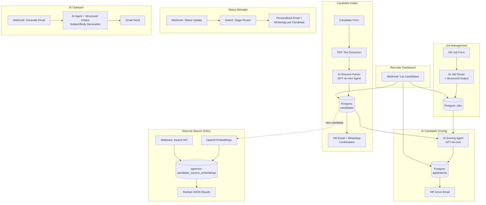

# AI Recruitment Assistant

**An end-to-end AI-powered recruitment automation platform** — resume parsing, semantic candidate search, AI-driven scoring, and personalized outreach, built entirely on n8n with LLM agents, structured output parsing, and pgvector RAG.

Built as a portfolio project demonstrating production-grade AI engineering and workflow automation, with an eye toward productizing as a B2B SaaS offering for recruitment teams.

---

## The Problem

Recruitment teams drown in repetitive, high-volume work: manually reading resumes, comparing candidates against job requirements, chasing status updates across email/WhatsApp, and searching past applicants when a new role opens. This system automates that pipeline end-to-end while keeping a human recruiter in control of every decision.

## Architecture



## Key Features

| Feature | What it does | AI/Engineering pattern demonstrated |
|---|---|---|
| **Resume Parsing** | Extracts structured candidate data (skills, experience, education, CTC) from raw PDF resumes | LLM agent with strict JSON schema enforcement, PDF text extraction pipeline |
| **AI Candidate Scoring** | Scores candidates 0–100 against job requirements with matched/missing skills and interview questions | Structured output parsing, prompt engineering for consistent JSON, ATS-style evaluation logic |
| **Semantic Resume Search** | Natural-language search across the candidate database ("DevOps engineer with Kubernetes") | RAG pipeline: OpenAI embeddings → pgvector similarity search → ranked results |
| **AI Outreach Generator** | Generates personalized candidate outreach emails referencing their actual skills/experience | Structured output agent, hallucination-guarded prompting (never invents candidate facts) |
| **Status-Driven Notifications** | Routes candidates through Shortlisted → Interview → Selected/Rejected stages with personalized email + WhatsApp at each step | Event-driven workflow branching, per-recipient dynamic templating |
| **Recruiter Dashboard API** | Queryable JSON endpoint for candidate/application data, filterable by job and stage | RESTful webhook API design over a workflow engine |

## Tech Stack

- **Orchestration:** n8n (self-hosted workflow automation)
- **LLMs:** OpenAI GPT-4o-mini / GPT-5-mini via LangChain agent nodes
- **Vector Search:** pgvector (Postgres extension), OpenAI `text-embedding-3-small`
- **Database:** Postgres (Supabase)
- **Integrations:** Gmail API, WhatsApp Business API, Google Drive, Google Calendar
- **Dashboard:** Streamlit + Supabase client SDK

## API Endpoints

All endpoints require an `x-api-key` header (shared-secret auth).

```bash
# List/filter candidates
GET /webhook/recruiter/candidates?status=Shortlisted&job_id=<uuid>

# Semantic resume search
GET /webhook/{search-path}?q=python+backend+developer&top_k=5

# Generate + send personalized outreach email
POST /webhook/recruiter/generate-email
Body: { "candidate_id": "...", "job_id": "...", "purpose": "..." }

# Update application status (triggers stage-specific notifications)
POST /webhook/{status-path}
Body: { "application_id": "...", "application_stage": "Shortlisted" }
```

## Engineering Decisions & Lessons

A few things worth calling out from building this (good interview talking points):

- **Zero-item execution gaps:** n8n silently skips downstream nodes when a node returns zero items — meaning a "no search results" case would return an empty HTTP body instead of a proper `[]`. Fixed by forcing a single always-emitted response item per branch (`{count, results}`) rather than relying on `alwaysOutputData` blindly, which creates its own footguns.
- **SQL parameter substitution pitfalls:** discovered that empty-string query parameters get silently stripped by n8n's Postgres node before substitution, breaking optional-filter queries. Solved with a non-empty sentinel value (`'__ALL__'`) instead of relying on empty strings.
- **Security-by-default:** every webhook was originally unauthenticated (fine for local dev, a real data leak in production) — candidate PII and email-sending capability were both publicly reachable. Locked down with a shared-secret guard on all inbound triggers.
- **Hallucination guardrails:** every AI agent prompt explicitly instructs "never invent information" and the output schema always includes an escape hatch (empty string/0) for missing data, rather than letting the model guess.

## Roadmap

- [ ] Multi-tenant architecture for SaaS productization (per-customer credential/DB isolation)
- [ ] Wire the Streamlit dashboard's action buttons to the live webhook API (currently draft-only)
- [ ] Admin UI for job/pipeline configuration instead of editing n8n directly
- [ ] Interview scheduling calendar sync polish
- [ ] Usage-based billing hooks for SaaS version

---

*Built by Saurabh Shinde as a demonstration of applied AI engineering: LLM agent orchestration, RAG, structured output parsing, and production workflow automation.*
